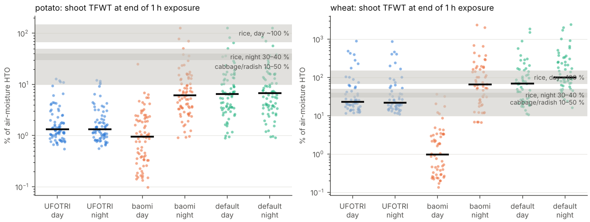
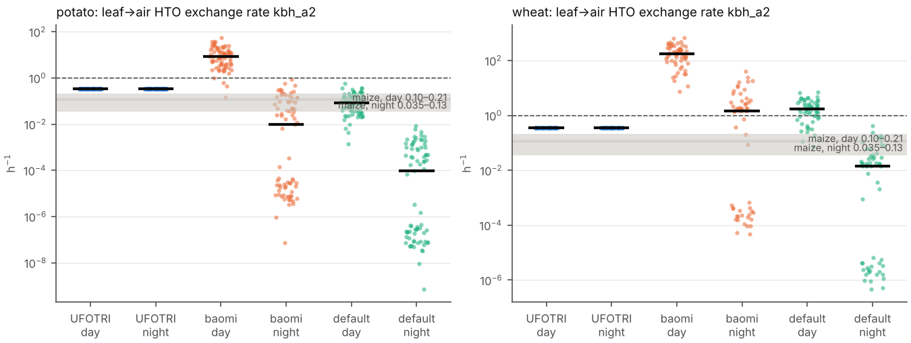
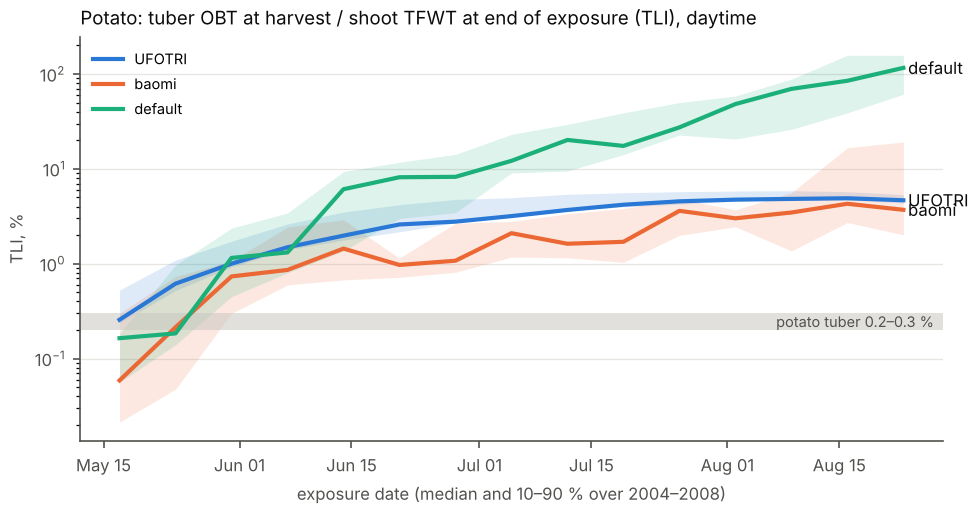
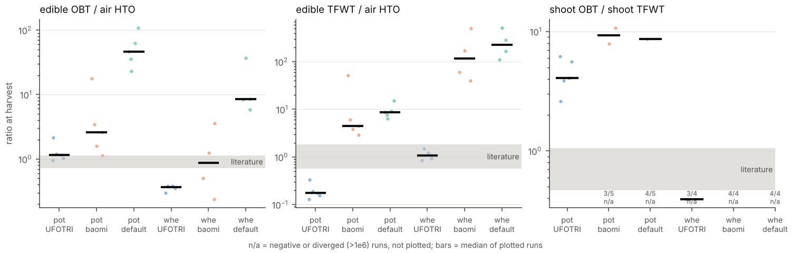

# 模型验证：公开文献数据 × Dmitte HTO 迁移模型

本目录用公开文献中的 HTO 暴露实验结果和公开气象/土壤/作物数据，对 `dmitte` 的空气–土壤–作物
氚迁移模型（`dmitte/transfer_equotions.py` + `dmitte/calc_para.py` + WOFOST）做外部验证。

```
validation/
├── benchmarks/                             # 文献基准 v2：46 条标量基准 + 17 个实验数据集（见 benchmarks/README.md）
├── build_inputs.py                         # 从公开数据构建 ./data（气象、土壤、作物参数、农事）
├── run_validation.py                       # 虚拟实验：1 h 急性暴露（昼/夜）+ 慢性暴露
├── analyze.py                              # 与文献基准对比，输出表格和图
├── exp_baomi_no_x100.py                    # 对照实验：baomi 去掉 kbh_a2 的 × 100
└── results/                                # 运行结果（CSV、图；experiments/ 为对照实验）
```

## 1 结论速览

本节和第 4 节是**第一步修正之后**（见第 5.1 节）用 v2 基准重新运行的结果；修正前的数值在第 4 节表中以 “修正前 → 修正后” 列出。

| 结论 | 依据 |
|---|---|
| 数值求解本身可靠 | 本验证用的逐小时矩阵指数传播与仓库 `solve_con()` 最大相对差 1.4×10⁻²（小麦 baomi，刚性最强），其余 ≤9×10⁻⁴ |
| 修正后谷物（CEREAL）分支不再发散 | 修正前 default/UFOTRI 下 `kbh_fo` 恒为负、库存发散到 10²⁸⁹、`solve_con()` 报错；修正后小麦 UFOTRI 慢性 TFWT/空气 1.06（文献 0.57–1.83） |
| default 的白天叶→气交换回到文献量级 | 马铃薯 0.012 → 0.085 h⁻¹（文献 0.10–0.21），即 Penman 单位修正约 7 倍 |
| **baomi 的 `× 100` 修正后明显过头，但直接去掉也不行** | 白天交换 8.5 h⁻¹（马铃薯）/ 174 h⁻¹（小麦）；去掉 `× 100` 后交换速率接近文献，但慢性块茎 OBT/空气从 2.6 升到 36（文献 0.72–1.14）。根源是释放项用蒸腾量（第 5 节 1），不是系数问题 |
| **昼夜差异仍然没有表现出来** | 夜/昼吸收比 1.0–63（文献 0.23–0.25）；昼/夜交换比 112–1 500（文献 3–5） |
| **块茎 TLI 仍偏高** | 0.2–0.3 %（文献）vs 1.5 %（baomi）、3.7 %（UFOTRI）、14 %（default，修正前 93 %） |
| **OBT 库存仍会变负** | `TROBT ∝ (PGASS − PMRES)` 在衰老期为负，慢性叶片 OBT/TFWT 在所有用 `TROBT` 的分支中为负 |

总的判断：模型框架和求解器没问题。第一步修正去掉了 CEREAL 分支的发散，并让 default 的交换速率回到文献量级；
但植物交换（第 5 节 1、3）和 OBT 生成（第 5 节 4）的参数化仍有机理偏差。剂量计算用的作物 OBT 在 default 下
仍高估约 1–2 个数量级（马铃薯慢性 OBT/空气 46，文献 ≈1），baomi 下马铃薯高估约 2–3 倍（2.6）。

## 2 数据

### 2.1 文献基准（`benchmarks/`，v2）

详见 [benchmarks/README.md](benchmarks/README.md)。v2 版对照 IAEA-TECDOC-1738、IAEA-TECDOC-1991、EMRAS 大豆/马铃薯情景报告、
EMRAS 氚与 C-14 工作组报告（Pickering 情景）和 Melintescu & Galeriu (arXiv:1609.05052) 的**全文**整理：

- `literature_benchmarks.csv`：46 条标量基准，其中 39 条已核对全文，7 条（玉米、菜豆、Chalk River 菜园、白菜叶 TFWT 下降倍数）仍只有摘要；
- `datasets/`：17 个逐次实验数据集，包括小麦、马铃薯、菜豆、水稻、大豆、萝卜、白菜、樱桃番茄的短时暴露实验，Pickering 慢性释放，MODARIA 田间数据，冲刷系数，马铃薯 ¹⁴C；
- `sources.csv`：文献登记。

马铃薯现在有直接的氚实验基准：2 h 暴露后叶片 TFWT 为空气水汽浓度的 83 %（白天）/ 14 %（夜间），块茎 TLI 0.2–0.3 %（TECDOC-1738 表 24）。

### 2.2 模型输入（`build_inputs.py`，全部公开、固定到 commit）

| 输入 | 来源 |
|---|---|
| 气象 | 荷兰 Wageningen Haarweg 站 2004–2008 逐日数据（Wageningen 大学气象组），取自 [ajwdewit/pcse_notebooks](https://github.com/ajwdewit/pcse_notebooks) `data/meteo/nl1.xlsx` |
| 土壤 | `ec2.soil`（EC2-medium，与原研究同名同参数：SMW 0.099、SMFCF 0.272、SM0 0.39），同上仓库 |
| 作物 | WOFOST 7.2 作物参数 [ajwdewit/WOFOST_crop_parameters@wofost72](https://github.com/ajwdewit/WOFOST_crop_parameters/tree/wofost72)：`Potato_701`、`Winter_wheat_102` |
| 农事 | 生成：马铃薯 5 月 1 日出苗，冬小麦前一年 10 月 20 日播种 |
| `meteo_usefor_cttm.xlsx` 中的派生量 | RH = 水汽压 / 日均温饱和水汽压；气压取标准大气（站点海拔 7 m）；5/10/20 cm 土壤含水量 = 同年马铃薯 WOFOST 根区含水量 SM（无作物期取田间持水量 0.272） |

## 3 方法

1. **虚拟实验**，按文献实验流程设计：
   - *急性*：植物在空气水汽 HTO 浓度恒定的箱中暴露 1 h，然后回到洁净空气直到收获。整个生长季每周做一次，
     每次分 11:00（白天）和 23:00（夜间）两组。马铃薯 2004–2008 共 5 季、小麦 2005–2008 共 4 季。
   - *慢性*：整个生长季空气 HTO 恒定（对应 Korolevych & Kim 的连续释放菜园）。
2. **模型原样使用**：迁移率来自 `transfer_rates`（default，`iaea-case1-HTO.py` 在用）、`transfer_rates_baomi`
   （`potato_HTO.py`、`cereals_HTO.py` 在用）、`transfer_rates_UFORTI`（UFOTRI 常数）；ODE 右端就是
   `transfer_equotions()` 本身。系统对 y 线性、迁移率逐小时分段常数，所以每小时的传播子 = 生成矩阵的矩阵指数，
   生成矩阵从 `transfer_equotions()` 逐列取出。唯一的改动是实验施加的边界条件：空气库室在暴露小时内固定为暴露浓度，
   其余时间为 0（洁净空气）。
3. **昼夜强迫**：仓库的 `meteodata()` 把日数据线性插值到小时，没有昼夜变化。为检验昼夜基准，`run_validation.py`
   用日数据生成逐时强迫（温度在 TMIN/TMAX 间余弦变化、辐射按太阳高度角分配、RH 由逐时温度计算），通过替换
   `calc_para.meteodata` 注入。同时也用仓库原始的逐日插值强迫跑了一遍（结果见 CSV 中 `forcing=daily`），两者除昼夜指标外结论一致。
4. **浓度换算**：叶片（地上部）TFWT = `A_bh / plant_w`；块茎/籽粒 TFWT = `A_fh / friut_w`；OBT 以燃烧水计，
   = OBT 库存 / (干物质 × 0.556 L/kg)（淀粉/纤维素含氢 6.2 %）；空气水汽量 = `ML × a_h`。
5. **判定**：取模型中位数（全部年份 × 暴露日期，逐时强迫），落在文献范围内为 ✅ 符合；与范围相差 3 倍以内为 ⚠️ 接近；
   超过 3 倍为 ❌ 偏离；≤0 或发散（|log₁₀| > 30）为 ⛔ 非物理。只给中心值的基准按 ×/÷1.5 作为容差。

## 4 结果

完整表见 `results/benchmark_comparison.csv`（含 5–95 % 分位）。下表为中位数与判定，“修正前 → 修正后” 对比第 5.1 节的第一步修正；
两次运行用同一套 v2 基准和输入。最后一列是去掉 baomi 中 `kbh_a2 × 100` 的对照实验（`exp_baomi_no_x100.py`，
结果在 `results/experiments/baomi_no_x100/`），在修正后的代码上运行。

| 基准 | 指标 | 作物 | UFOTRI | baomi | default | baomi 去掉 ×100 | 文献 |
|---|---|---|---|---|---|---|---|
| B1 | 暴露结束地上部 TFWT/空气，% | 马铃薯 | 1.3 ❌ → 1.3 ❌ | 4.8 ❌ → 2.6 ❌ | 6.8 ❌ → 6.5 ❌ | 6.5 ❌ | 22–46 |
|  |  | 小麦 | 25 ✅ → 22 ✅ | 52 ⚠️ → 12 ⚠️ | 117 ⚠️ → 84 ⚠️ | 94 ⚠️ | 22–46 |
| B2 | 同上（白天），% | 马铃薯 | 1.3 ❌ → 1.3 ❌ | 3.5 ❌ → 0.96 ❌ | 6.9 ❌ → 6.5 ❌ | 6.5 ❌ | 60–100 |
|  |  | 小麦 | 25 ⚠️ → 23 ⚠️ | 8.5 ❌ → 0.96 ❌ | 109 ⚠️ → 69 ✅ | 73 ✅ | 60–100 |
| B3 | 同上（夜间），% | 马铃薯 | 1.3 ❌ → 1.3 ❌ | 6.7 ❌ → 6.2 ❌ | 6.8 ❌ → 6.7 ❌ | 6.7 ❌ | 30–40 |
|  |  | 小麦 | 25 ⚠️ → 22 ⚠️ | 112 ⚠️ → 65 ⚠️ | 125 ❌ → 100 ⚠️ | 112 ⚠️ | 30–40 |
| B4 | 夜/昼吸收比 | 马铃薯 | 1.0 ❌ → 1.0 ❌ | 1.7 ❌ → 8.2 ❌ | 1.0 ❌ → 1.0 ❌ | 1.0 ❌ | 0.23–0.25 |
|  |  | 小麦 | 1.0 ❌ → 1.0 ❌ | 23 ❌ → 63 ❌ | 1.1 ❌ → 2.0 ❌ | 2.1 ❌ | 0.23–0.25 |
| B7 | 白天叶→气交换 kbh_a2，h⁻¹ | 马铃薯 | 0.35 ⚠️ → 0.35 ⚠️ | 1.2 ❌ → 8.5 ❌ | 0.012 ❌ → 0.085 ⚠️ | 0.085 ⚠️ | 0.10–0.21 |
|  |  | 小麦 | 0.35 ⚠️ → 0.35 ⚠️ | 24 ❌ → 174 ❌ | 0.24 ⚠️ → 1.7 ❌ | 1.7 ❌ | 0.10–0.21 |
| B8 | 夜间叶→气交换，h⁻¹ | 马铃薯 | 0.35 ⚠️ → 0.35 ⚠️ | 5×10⁻⁶ ❌ → 1×10⁻² ❌ | 5×10⁻⁸ ❌ → 1×10⁻⁴ ❌ | 1×10⁻⁴ ❌ | 0.035–0.13 |
|  |  | 小麦 | 0.35 ⚠️ → 0.35 ⚠️ | 2×10⁻⁴ ❌ → 1.4 ❌ | 2×10⁻⁶ ❌ → 0.014 ⚠️ | 0.014 ⚠️ | 0.035–0.13 |
| B6 | 昼/夜交换比 | 马铃薯 | 1 ⚠️ → 1 ⚠️ | 3×10⁵ ❌ → 1 500 ❌ | 3×10⁵ ❌ → 1 500 ❌ | 1 500 ❌ | 3–5 |
|  |  | 小麦 | 1 ⚠️ → 1 ⚠️ | 1×10⁵ ❌ → 112 ❌ | 1×10⁵ ❌ → 112 ❌ | 112 ❌ | 3–5 |
| B9 | 叶片 TFWT 暴露→收获下降倍数 | 马铃薯 | 5 400 ✅ → 5 400 ✅ | 660 ✅ → 560 ⚠️ | 5.5 ❌ → 40 ❌ | 45 ❌ | 600–95 000 |
|  |  | 小麦 | 发散 ⛔ → 3 400 ✅ | 1 200 ✅ → 440 ⚠️ | 发散 ⛔ → 225 ⚠️ | 840 ✅ | 600–95 000 |
| B10 | 块茎 TFWT 峰值→收获下降倍数 | 马铃薯 | 83 ✅ → 83 ✅ | 12 ✅ → 13 ✅ | 1.4 ✅ → 6.1 ✅ | 3.6 ✅ | ≤1.3×10⁴ |
| B12 | TLI 块茎，% | 马铃薯 | 3.7 ❌ → 3.7 ❌ | 1.2 ❌ → 1.5 ❌ | 93 ❌ → 14 ❌ | 14 ❌ | 0.2–0.3 |
| B15 | 夜/昼 OBT 生成 | 马铃薯 | 1.0 ⚠️ → 1.0 ⚠️ | 4.0 ❌ → 3.5 ❌ | 1.0 ⚠️ → 1.1 ⚠️ | 1.1 ⚠️ | 0.1–0.5 |
|  |  | 小麦 | 1.1 ⚠️ → 1.0 ⚠️ | 2.7 ❌ → 0.87 ⚠️ | 1.0 ⚠️ → 2.5 ❌ | 4.0 ❌ | 0.1–0.5 |
| B16 | 暴露结束 OBT/空气，% | 马铃薯 | 0.006 ❌ → 0.006 ❌ | 0.17 ✅ → 0.051 ⚠️ | 0.32 ⚠️ → 0.31 ⚠️ | 0.31 ⚠️ | 0.13–0.3 |
|  |  | 小麦 | 负值 ⛔ → 0.056 ⚠️ | 0.024 ❌ → 0.003 ❌ | 负值 ⛔ → 0.13 ⚠️ | 0.13 ⚠️ | 0.13–0.3 |
| B17 | 24 h 后 OBT 占植物总氚，% | 马铃薯 | 7.2 ⚠️ → 7.2 ⚠️ | 46 ❌ → 28 ❌ | 27 ❌ → 34 ❌ | 30 ❌ | 2–4 |
|  |  | 小麦 | 0.79 ⚠️ → 21 ❌ | 57 ❌ → 58 ❌ | 0.79 ⚠️ → 6.0 ⚠️ | 55 ❌ | 2–4 |
| B18 | 慢性：块茎/籽粒 OBT / 空气 | 马铃薯 | 1.15 ⚠️ → 1.15 ⚠️ | 5.3 ❌ → 2.6 ⚠️ | 225 ❌ → 46 ❌ | 36 ❌ | 0.72–1.14 |
|  |  | 小麦 | 发散 ⛔ → 0.37 ⚠️ | 1.4 ⚠️ → 0.87 ✅ | 发散 ⛔ → 8.5 ❌ | 3.3 ⚠️ | 0.72–1.14 |
| B19 | 慢性：块茎/籽粒 TFWT / 空气 | 马铃薯 | 0.18 ❌ → 0.18 ❌ | 8.5 ❌ → 4.4 ⚠️ | 13 ❌ → 8.7 ❌ | 37 ❌ | 0.57–1.83 |
|  |  | 小麦 | 发散 ⛔ → 1.06 ✅ | 212 ❌ → 116 ❌ | 发散 ⛔ → 224 ❌ | 461 ❌ | 0.57–1.83 |
| B20 | 慢性：叶片 OBT/TFWT | 马铃薯 | 4.1 ❌ → 4.1 ❌ | 负值 ⛔ → 负值 ⛔ | 负值 ⛔ → 负值 ⛔ | 负值 ⛔ | 0.64–1.3 |
|  |  | 小麦 | 负值 ⛔ → 负值 ⛔ | 负值 ⛔ → 负值 ⛔ | 发散 ⛔ → 负值 ⛔ | 负值 ⛔ | 0.64–1.3 |

判定数（共 33 项）：

| | ✅ 符合 | ⚠️ 接近 | ❌ 偏离 | ⛔ 非物理 |
|---|---|---|---|---|
| UFOTRI 修正前 → 后 | 3 → 5 | 15 → 16 | 10 → 11 | 5 → 1 |
| baomi 修正前 → 后 | 5 → 2 | 3 → 8 | 23 → 21 | 2 → 2 |
| default 修正前 → 后 | 1 → 2 | 7 → 10 | 19 → 19 | 6 → 2 |
| baomi 去掉 ×100（修正后） | 3 | 9 | 19 | 2 |

马铃薯 UFOTRI 几乎不变，因为它的 ROOT_VEG 分支除沉积速度外都是常数。






## 5 发现的问题

### 5.1 第一步已修正（本次提交）

对应设计 review 的“立刻修且无争议”一组；回归测试在 `tests/test_rate_fixes.py`。

| 问题 | 修正 | 影响的函数 |
|---|---|---|
| OBT 食入剂量系数写成 4.2e-7 mSv/Bq | ICRP-72 成人值 4.2e-8（HTO 1.8e-8 不变），集中到 `para_constant.DOSE_COEF_OBT/HTO` | 所有剂量脚本，OBT 剂量降为原来的 1/10 |
| Penman–Monteith：`CP = 1.013`（应为 J/(kg·K)）、`GAM = 0.67`（hPa/K，而 es、DELE 是 kPa） | `CP = 1013`、`GAM = 0.067` | `calc_ESOIL`、`calc_ETRM`（全部变体） |
| `ks1_a2 = ESOIL / BODW1`：分母是体积含水率 | 改为第 1 层水量 `soil1w`（kg/m²） | default、Korea、baomi、morris |
| `ks3_bh`、`ks3_fh` 分母用了 `soil1w` | 改为 `soil3w` | CEREAL/ROOT_VEG 的全部变体 |
| `kbh_fo = np.log(2/(HWZ/2))`：恒为负、缺 `/24` | `np.log(2)/(HWZ/2)/24` | default、UFOTRI、Korea 的 CEREAL 分支；TUBER_VEG 分支 |
| `HWZ[airfx.sta-1]`：用大气稳定度索引作物参数，`sta=6` 时 IndexError（`cereals_HTO.py` 第 3 个 case 无法运行） | 按作物 `HWZ[airfx.ICOMP-1]`（马铃薯 90 d、小麦 60 d） | 同上 |
| `np.log2(10)` | `np.log(2)` | default、UFOTRI、Korea 的 CEREAL `kbh_fh`；Korea `kbo_bh` |

`potato_HTO.py`、`cereals_HTO.py` 用的 baomi 版本里 CEREAL/ROOT_VEG 的 `kbh_fo`、`kbh_fh` 本来就是写死的正确形式，
这两项只影响其他变体。仓库 `figures/dose_HTO/*.csv` 是用旧代码和原始站点数据生成的，本仓库没有原始数据，未重新生成。

### 5.2 仍未解决（按影响排序）

1. **叶→气交换用的是蒸腾量，不是交换通量**（`kbh_a2 = plantfx.ETRM / plantfx.plant_w`）。
   吸收端是沉积速度 `VDPF = 1/(RAM+RB+RC1)` 乘空气水汽量，相当于 g·ρ_v·C_air；释放端却是蒸腾 E = g·(ρ_sat − ρ_v)。
   稳态时 C_leaf/C_air ≈ ρ_v/(ρ_sat − ρ_v) = RH/(1 − RH)，RH = 0.75 时为 3，而物理上应 ≤ RH/α（≈0.7）。
   修正 Penman 单位后夜间交换仍只有 10⁻⁴–10⁻² h⁻¹（马铃薯），昼/夜比 112–1 500（文献 3–5）。
   `exp_baomi_no_x100.py` 说明 baomi 的 `× 100` 不是单纯的单位补偿：去掉它，白天交换速率接近文献，
   但叶片夜间几乎不释放，慢性块茎 OBT/空气从 2.6 升到 36；保留它，白天交换又高出 40–800 倍，
   白天暴露时叶片在 1 h 内就把吸收的 HTO 释放掉（夜/昼吸收比 8–63）。两种取法都不对，应把释放项改为
   g·ρ_sat(T_leaf)/W_leaf（与 UFOTRI/CTEM 一致），蒸腾只作为根系吸水通道，然后再决定是否保留经验系数。
2. **气孔阻力单位与昼夜变化**：`calc_ETRM` 把 `RC1 × 100` 当 s/m 用（按 s/cm 理解），`calc_VDPF` 直接把 `RC1`
   当 s/m 用；`calc_st_res` 的条件 `... | (ISTRE == 1)` 在默认 `ISTRE=1` 时恒为真，RC1 恒等于 RC/LAI，
   所以吸收（`ka2_bh`）白天夜里一样，夜/昼吸收比 ≈1（文献 0.23–0.25）。
3. **OBT 生成**：`calc_transOBT` 用逐日 `PGASS − PMRES` 插值到小时，没有昼夜变化；衰老期呼吸大于同化时为负，
   `kbh_bo < 0`，OBT 库存变负（凡用 `TROBT` 的分支都会出现，只有 UFOTRI 的 ROOT_VEG 常数分支不受影响）。
4. **`kfh_bh = kbh_fh·plant_w/friut_w` 在籽粒/块茎形成前为 inf**（default 和 UFOTRI 的小麦每季 1 000–1 400 个、default 马铃薯每季 70–270 个非有限值）。
   baomi 用 `np.maximum(friut_w, 20)` 避开了。验证中把非有限值置 0。
5. **`ks1_s2`、`ks2_s3`（达西通量）在向上水流时为负**（default 马铃薯 5 季中 3 季出现，每季最多约 1 060 个负值），`iaea-case1-HTO.py` 的
   `np.abs(k_array)` 仍在翻转其方向；应拆成两个非负的上、下行速率。
6. **干物质比例**：`cereals_HTO.py` 用籽粒干物质比例 0.86 计算整株含水量（`plant_w = tagp·(1−dm)/dm`），
   整株含水被低估约 10 倍，地上部 TFWT 超过空气浓度（>100 %，非物理），小麦 kbh_a2 也因此比马铃薯高约 20 倍。
   马铃薯的 `plant_w` 用 TAGP（含块茎）计算，把“叶片”HTO 稀释到了块茎水里，这是马铃薯 B1–B3 偏低的一部分原因。
7. **已修复的可复现性问题**（上一次提交）：
   - PCSE 5.5 默认从 `WOFOST_crop_parameters` 的 `master` 分支下载作物参数，而该分支现已清空，新克隆无法运行。
     现改为优先读 `./data/crop/wofost72`，否则用 `wofost72` 分支。
   - 原代码依赖一份手工改过的 PCSE 配置（输出 `PGASS`、`PMRES`），标准 PCSE 不输出这两个变量，`Calc_plant` 会 KeyError。
     现在随仓库提供 `dmitte/conf/Wofost72_WLP_FD_dmitte.conf`，并通过 `Engine(config=...)` 使用。

## 6 局限

- 部分基准仍来自其他作物（水稻、大豆、萝卜等），只适合判断量级和定性行为（昼夜比、衰减幅度），不适合精细标定。
- 气象是荷兰 Wageningen，不是实验所在地（韩国大田、德国卡尔斯鲁厄、加拿大 Chalk River）；逐时强迫是由日数据合成的。
- 土壤三层含水量都用 WOFOST 根区 SM，没有分层观测。
- 大气扩散（高斯烟团）部分没有验证：可用的公开示踪实验（如 Prairie Grass）在本环境无法下载。

## 7 复现

```bash
pip install -r requirements-dev.txt          # Python 3.12
python validation/build_inputs.py           # 下载公开数据，生成 ./data（约 1 MB）
python validation/run_validation.py         # 约 1 分钟，写 validation/results/*.csv
python validation/analyze.py                # 对比表 + 图
python validation/exp_baomi_no_x100.py      # 对照实验：baomi 去掉 kbh_a2 的 × 100
python -m pytest tests                      # 含第一步修正的回归测试
```
